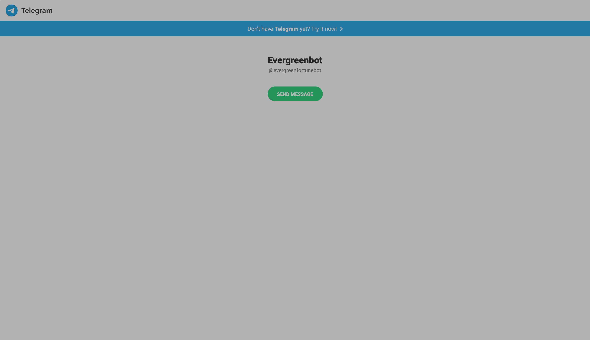

# Microverse Ruby Capstone Project

## Telegram Bot (Evergreenbot)
- This Telegram 🤖 Bot is built with Ruby And Telegram bot API(https://core.telegram.org/bots/api)
- Simply search for 'Evergreenbot'. 
- This 🤖 Bot accepts some basic commands and respond with Good morning quotes, programming quotes or lifehack quotes Randomly depending on the User selection and command input.



## Install and Run the Bot Locally

In order to run this 🤖 Bot, you need to install RUBY in your local machine. For instructions on how to install ruby on windows, go to [Ruby installer](https://rubyinstaller.org/)  for instructions on how to install ruby on MAC and LINUX, go to [Ruby official site](https://www.ruby-lang.org/en/downloads/).

## When you have Ruby Installed in your System, please follow the steps below to run the Bot

**Step 1**<br>
Clone the repo into your local folder where you want to run it<br>
`https://github.com/fortuneonyeka/my_telegram_bot.git`.<br>
**Step 2**<br>
Enter your API key to run the application.<br>
**Step 3**<br> 
Run `bundle install` to install the gems from the `Gemfile`.<br>
**Step 4**<br>
Run `bin/main.rb` to start the bot.<br>
**Step 5**<br>
You can use the commands defined in the [Available commands section](#Commands to Run the Bot) defined below.<br>

#### This Bot is Live Now. You can click [🤖 here](t.me/evergreenfortunebot.)to Play with Bot

## Built With
- Ruby
- Telegram-bot-ruby & Telegram API
- Rspec
- vsCode

## Commands to Run the Bot
This Bot has 7 commands
- [x] /start - Gives you brief information about the Bot and how to interact with the it
- [x] /quit - It gives the user the chance to quit the Bot if He/She wishes 
- [x] /Confirm  - confirms user wish to quit.
- [x] /lifehack - It provides random lifehack quotes.
- [x] /morning_motivation - It provides random good morning quotes.
- [x] /programming_quotes - It provides random programmers quotes.
- [x] /exit - It ends the Bot's interaction with the user

### How to Run Tests

#### Installing Rspec
Open up your terminal and run `gem install rspec` to install RSpec. When you have done that, you can verify your version of RSpec with `rspec --version`. Take a minute also to run `rspec --help` and look through the various options available.

- You Need To Run 
```
$ gem install rspec

```
$ bundle install or bundle
```
- Run tests with "rspec" in your terminal

## Author

👤 **Ihedoro Fortunatus**

- GitHub: [@fortuneonyeka](https://github.com/fortuneonyeka)
- Twitter: [@fortuneonyeka](https://twitter.com/fortuneonyeka)
- LinkedIn: [Ihedoro Fortunatus](https://www.linkedin.com/in/fortunatus-ihedoro-5a43711a3/)

## 🤝 Contribution

If you want to contribute or have a feature to add.
- Go to the project repository 
- Open a pull request
or
- Feel free to click on the [issues page](https://github.com/fortuneonyeka/my_telegram_bot/issues/1).

Contributions, issues and feature requests are welcome!

## Show Your Support
Give a ⭐️ if you like this project!

## Acknowledgments

- Project inspired by Microverse.

## 📝 License

This project is [MIT](https://mit-license.org/) licensed.